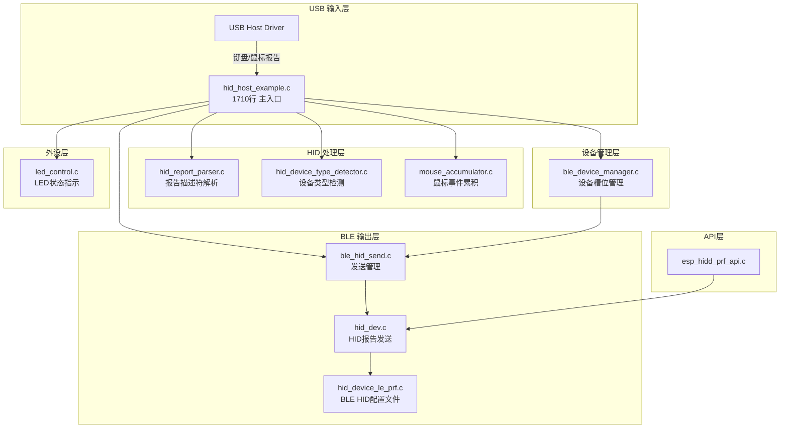

# ESP-BLE-Keyboard-Mouse Main模块架构分析

> 本文保留重构前的架构分析与建议，行号和问题描述对应当时版本。当前修复状态与验证结果请查看 [项目 review 与修复验证](PROJECT_REVIEW_2026-10-05.md)。

## 项目概述

该项目实现了一个 USB HID 转 BLE HID 的桥接器，支持将 USB 键盘和鼠标的输入转发到 BLE 设备。

## 当前架构概览



---

## 🔴 问题1：主文件过于庞大（严重）

### 问题描述
[hid_host_example.c](file:///Users/weijiangchen/src/ESP-BLE-Keyboard-Mouse/main/hid_host_example.c) 文件达到 **1710行**，承担了过多职责：

| 职责 | 行数范围 | 说明 |
|------|----------|------|
| BLE 配置和初始化 | 85-122 | 广播数据、参数配置 |
| BLE 事件处理 | 252-436 | 连接/断开/认证回调 |
| USB HID 事件处理 | 529-1200+ | 键盘/鼠标报告回调 |
| 热键检测逻辑 | 487-527 | Alt+`/Alt+N 检测 |
| 鼠标报告解析 | 643-950+ | 复杂的位域解析 |
| 主函数和初始化 | 1400-1710 | app_main |

### 优化建议

```diff
将大文件拆分为独立模块：

+ 新建 usb_hid_host.c/h    - USB HID 主机逻辑
+ 新建 keyboard_handler.c/h - 键盘报告处理
+ 新建 mouse_handler.c/h   - 鼠标报告处理
+ 新建 hotkey_detector.c/h - 热键检测逻辑
+ 新建 ble_init.c/h        - BLE 初始化和配置

- 保留 hid_host_example.c 作为精简的主入口（约200行）
```

---

## 🔴 问题2：全局变量过多且散乱（严重）

### 问题描述

在 `hid_host_example.c` 中存在大量全局变量：

```c
// 文件 hid_host_example.c 中的全局变量
uint16_t ble_hid_conn_id = 0;           // BLE连接ID
bool sec_conn = false;                   // 安全连接状态
static usb_hid_devices_t usb_hid_devices; // USB设备句柄
static hid_report_layout_t g_mouse_layouts[MAX_MOUSE_LAYOUTS]; // 鼠标布局
static int g_mouse_layout_count = 0;
static hid_report_layout_t *g_cached_layout = NULL;
static uint8_t g_cached_report_id = 0xFF;
led_strip_handle_t led_strip = NULL;    // LED句柄
QueueHandle_t app_event_queue = NULL;   // 事件队列
```

这些全局变量被多个模块通过 `extern` 引用：

```c
// 文件 ble_device_manager.c
extern bool sec_conn;
extern uint16_t ble_hid_conn_id;

// 文件 ble_hid_send.c
extern uint16_t ble_hid_conn_id;
extern hidd_le_env_t hidd_le_env;
```

### 优化建议

1. **封装为结构体**：将相关变量组织成逻辑结构
2. **提供访问函数**：替代 extern 直接访问

```c
// 建议：新建 ble_state.h/c
typedef struct {
    uint16_t conn_id;
    bool sec_conn;
    bool send_enabled;
} ble_connection_state_t;

ble_connection_state_t* ble_state_get(void);
void ble_state_set_conn_id(uint16_t id);
bool ble_state_is_connected(void);
```

---

## 🟡 问题3：重复的状态检查逻辑（中等）

### 问题描述

在 `ble_hid_send.c` 中存在双重状态检查：

```c
// ble_hid_send.c:127-133
static esp_err_t ble_hid_send_report_internal(...) {
    if (s_send_enabled && !s_switching_locked) {
        // 再次检查 ble_device_manager 的状态（双重保险）
        if (!ble_device_manager_is_switching()) {  // ← 重复检查
            ret = hid_dev_send_report(...);
        }
    }
}
```

同时在 `hid_host_example.c` 中也有类似逻辑：

```c
// hid_host_example.c:540, 597
if (!ble_hid_send_is_ready()) { return; }
// ... 处理逻辑 ...
if (!ble_hid_send_is_ready()) { return; }  // ← 再次检查
```

### 优化建议

统一状态管理，避免重复检查：
- `ble_hid_send_is_ready()` 应该是唯一的状态检查点
- 移除 `ble_hid_send_report_internal` 中的 `ble_device_manager_is_switching()` 调用

---

## 🟡 问题4：宏定义重复定义（中等）

### 问题描述

`USE_16BIT_MOUSE_PRECISION` 和相关宏在三个文件中重复定义：

| 文件 | 定义位置 |
|------|----------|
| [hid_host_example.c](file:///Users/weijiangchen/src/ESP-BLE-Keyboard-Mouse/main/hid_host_example.c#L58) | 第58行 |
| [esp_hidd_prf_api.c](file:///Users/weijiangchen/src/ESP-BLE-Keyboard-Mouse/main/esp_hidd_prf_api.c#L27) | 第27行 |
| hid_device_le_prf.c | 注释中提及需保持一致 |

```c
// 三个文件中都有这段注释
// 注意：此宏必须与hid_device_le_prf.c和esp_hidd_prf_api.c中的定义保持一致
#define USE_16BIT_MOUSE_PRECISION 1
#define HID_MOUSE_IN_RPT_LEN 6
```

### 优化建议

集中定义到一个公共头文件：

```c
// 新建 hid_config.h
#ifndef HID_CONFIG_H
#define HID_CONFIG_H

#define USE_16BIT_MOUSE_PRECISION 1
#define HID_MOUSE_IN_RPT_LEN 6
#define HID_KEYBOARD_IN_RPT_LEN 8
#define HID_CC_IN_RPT_LEN 2

#endif
```

---

## 🟡 问题5：模块间循环依赖（中等）

### 依赖关系图


`ble_hid_send.c` 和 `ble_device_manager.c` 存在相互依赖：
- `ble_hid_send.c` 调用 `ble_device_manager_is_switching()`
- `ble_device_manager.c` 调用 `ble_hid_send_enable()`

### 优化建议

引入抽象层或使用回调机制：

```c
// 方案1：提取公共状态模块
// 新建 ble_common_state.h/c
typedef struct {
    bool switching;
    bool discovering;
    bool send_enabled;
} ble_common_state_t;

// 方案2：使用回调解耦
typedef void (*ble_state_change_callback_t)(bool enabled);
void ble_device_manager_register_callback(ble_state_change_callback_t cb);
```

---

## 🟢 问题6：mouse_accumulator 与主模块耦合（轻微）

### 问题描述

`mouse_accumulator.c` 依赖外部函数，这些函数在 `hid_host_example.c` 中实现：

```c
// mouse_accumulator.h 声明
extern bool mouse_accumulator_is_ble_connected(void);
extern esp_err_t mouse_accumulator_send_ble_report(const uint8_t *report, uint8_t length);

// hid_host_example.c 实现
bool mouse_accumulator_is_ble_connected(void) {
    return ble_hid_send_is_ready();
}
esp_err_t mouse_accumulator_send_ble_report(const uint8_t *report, uint8_t length) {
    return ble_hid_send_mouse_report(report, length);
}
```

### 优化建议

使用回调注册模式：

```c
// mouse_accumulator.h
typedef bool (*ble_check_connected_fn)(void);
typedef esp_err_t (*ble_send_report_fn)(const uint8_t*, uint8_t);

void mouse_accumulator_set_callbacks(
    ble_check_connected_fn check_fn,
    ble_send_report_fn send_fn
);
```

---

## 📊 问题汇总

| 优先级 | 问题 | 影响范围 | 建议行动 |
|--------|------|----------|----------|
| 🔴 高 | 主文件过大 | 可维护性 | 拆分为5-6个模块 |
| 🔴 高 | 全局变量散乱 | 可测试性、线程安全 | 封装访问函数 |
| 🟡 中 | 状态检查重复 | 性能、可读性 | 统一检查点 |
| 🟡 中 | 宏定义重复 | 维护风险 | 集中定义 |
| 🟡 中 | 模块循环依赖 | 架构清晰度 | 引入抽象层 |
| 🟢 低 | 累积器耦合 | 可测试性 | 回调注册 |

---

## 🎯 推荐的重构优先级

### 第一阶段（低风险，高收益）
1. 创建 `hid_config.h` 统一宏定义
2. 封装全局状态访问函数

### 第二阶段（中等风险）
3. 拆分 `hid_host_example.c`
   - 提取 USB 处理逻辑
   - 提取键盘/鼠标处理
   - 提取热键检测

### 第三阶段（需谨慎）
4. 解耦模块间依赖
5. 重构回调机制
